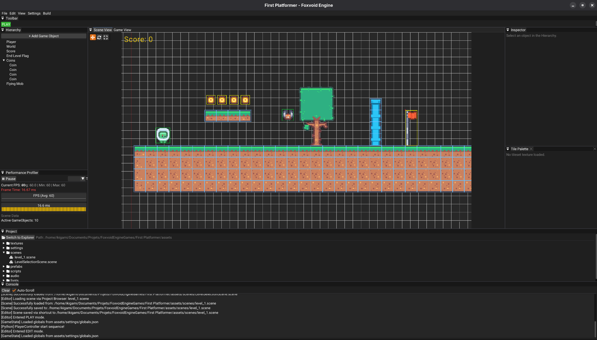

# Foxvoid Engine


**Foxvoid Engine** is a lightweight, data-driven 2D game engine build with **C++** and **Raylib**, featuring an integrated **ImGui Editor** and a powerful **Python Scripting** layer. Designed for rapid prototyping and indie game development, it provides a seamless bridge between high-performance native systems and flexible gameplay scripting.

---

## Key Features

* **Entity Component System (ECS):** A robust, hierarchy-based (Parent/Child) architecture managing GameObjects and modular components.
* **Integrated Editor:** Fully featured visual workspace built with ImGui. Includes a Scene View, Hierarchy Panel (with drag-and-drop), Inspector, Tile Palette, and a Performance Profiler.
* **Undo/Redo Command History:** A non-destructive workflow in the editor using the Command pattern for safe experimentation.
* **Native Python Scripting:** Write gameplay logic in Python via `pybind11`. Python scripts natively access the C++ ECS, physics, audio, and rendering systems with zero overhead.
* **2D Physics & Raycasting:** Custom AABB collision resolution, kinematic/dynamic rigidbodies, collision normals, and global line-of-sight raycasting.
* **Tilemaps & Animation:** Built-in tools for drawing multi-layered physics-enabled tile worlds and managing sprite sheet animations via `Animator2d`.
* **UI & Audio Subsystems:** Create interactive HUDs with `Button` and `TextRenderer`, and manage SFX/Music through the `AudioSource` component.
* **Data-Driven:** Scenes and Prefabs are fully serialized to JSON, making version control and content management effortless.

## Showcase



---

## Python Scripting API

Foxvoid exposes a highly expressive Python API (complete with `.pyi` type hinting for IDE autocompletion). You can attach logic, handle inputs, cast rays, and play sounds natively.

### Available Native Components
* **Transform / Physics:** `Transform2d`, `RigidBody2d`, `RectCollider`
* **Rendering:** `SpriteRenderer`, `SpriteSheetRenderer`, `ShapeRenderer`, `TextRenderer`, `Camera2d`
* **Animation / Level:** `Animation2d`, `Animator2d`, `TileMap`
* **UI / Audio:** `Button`, `AudioSource`

### "Hello World" Player Controller
Here is an example of a Python script interacting with the engine's Input, Physics, and Audio systems:

```python
from foxvoid import *
from typing import Optional

class PlayerController(Component):
    def __init__(self):
        super().__init__()
        self.speed = 400.0
        self.jump_force = -700.0
        
        self._rb: Optional[RigidBody2d] = None
        self._audio: Optional[AudioSource] = None

    def start(self):
        # Cache native C++ components
        self._rb = self.game_object.get_component(RigidBody2d)
        self._audio = self.game_object.get_component(AudioSource)
        
        if self._audio:
            self._audio.load_sfx("jump", "assets/sounds/jump.wav")

    def update(self, delta_time: float):
        if not self._rb: return

        # Horizontal Movement
        if Input.is_action_down("walk_right"):
            self._rb.velocity.x = self.speed
        elif Input.is_action_down("walk_left"):
            self._rb.velocity.x = -self.speed
        else:
            self._rb.velocity.x = 0.0

        # Jumping & Audio
        if Input.is_action_pressed("jump") and self._rb.is_grounded:
            self._rb.velocity.y = self.jump_force
            if self._audio:
                self._audio.play_sfx("jump")
```

## Architecture Overview

The codebase is strictly organized to separate engine core loops, editor tools, and rendering subsystems

```
src/
├── audio/      # SFX and Music management (AudioSource)
├── core/       # Engine loop, AssetManager, InputManager, GameState
├── editor/     # ImGui Panels (Hierarchy, Inspector, TilePalette) & Command History
├── graphics/   # Sprite, Camera, TileMap, and Animator2d implementations
├── gui/        # Screen-space HUD elements (Buttons, TextRenderer)
├── physics/    # Custom AABB engine, Colliders, Raycasting, and Transform math
├── scripting/  # Pybind11 C++ to Python bindings and ScriptEngine
└── world/      # ECS base (Scene, GameObject, ComponentRegistry)
```

## Getting Started

### Prerequisites

To build Foxvoid Engine, you will need:
- **CMake** (v3.15+)
- A c++20 compatible compiler (GCC, Clang, or MSVC)
- **Python 3.x** (with development headers installed)
- *Dependencies handled automatically*: Raylib, Pybind11, ImGui, ImGuizmo, nlohmann/json.

### Building from Source (Linux / macOS / Window)

```bash
# Clone the repository
git clone [https://github.com/yourusername/FoxvoidEngine.git](https://github.com/yourusername/FoxvoidEngine.git)
cd FoxvoidEngine

# Create a build directory
mkdir build && cd build

# Generate project files and compile
cmake ..
cmake --build.
```

To run the engine:

```bash
# Linux / macOS
./FoxvoidEngine

# Windows
.\Debug\FoxvoidEngine.exe
```

## License

This project is licensed under the zlib License - see the [LICENSE](LICENSE) file for details.
